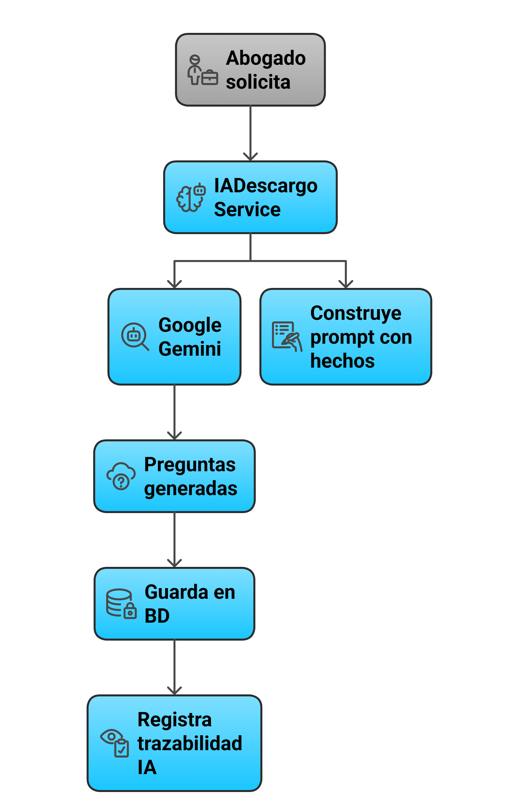

## Flujo Principal del Sistema

```
┌─────────────────────────────────────────────────────────────────────────────┐
│                              INICIO DEL PROCESO                              │
└─────────────────────────────────────────────────────────────────────────────┘
                                       │
                                       ▼
┌─────────────────────────────────────────────────────────────────────────────┐
│  1. SOLICITUD DE PROCESO                                                     │
│  ────────────────────────                                                    │
│  • Cliente (RRHH) reporta los hechos                                        │
│  • Se adjuntan pruebas iniciales                                            │
│  • Se identifican artículos presuntamente incumplidos                       │
└─────────────────────────────────────────────────────────────────────────────┘
                                       │
                                       ▼
┌─────────────────────────────────────────────────────────────────────────────┐
│  2. APERTURA DEL PROCESO                                                     │
│  ───────────────────────                                                     │
│  • Admin/Abogado crea el proceso en el sistema                              │
│  • Se genera código único (PD-YYYY-XXXX)                                    │
│  • Estado: APERTURA                                                          │
│  • Se asigna abogado (manual o automático por disponibilidad)               │
└─────────────────────────────────────────────────────────────────────────────┘
                                       │
                                       ▼
┌─────────────────────────────────────────────────────────────────────────────┐
│  3. PROGRAMACIÓN DE DESCARGOS                                                │
│  ────────────────────────────                                                │
│  • Se define fecha, hora y modalidad                                        │
│  • Modalidades: Presencial | Virtual | Telefónica                           │
│  • Se genera token de acceso temporal (válido 6 días)                       │
│  • Estado cambia a: DESCARGOS_PENDIENTES                                    │
└─────────────────────────────────────────────────────────────────────────────┘
                                       │
                                       ▼
┌─────────────────────────────────────────────────────────────────────────────┐
│  4. GENERACIÓN DE CITACIÓN                                                   │
│  ─────────────────────────                                                   │
│  • Se genera documento de citación (PDF/Word)                               │
│  • Variables interpoladas: nombre, fecha, lugar, hechos                     │
│  • Se envía por correo al trabajador                                        │
│  • Se activa tracking de apertura de email                                  │
└─────────────────────────────────────────────────────────────────────────────┘
                                       │
                                       ▼
┌─────────────────────────────────────────────────────────────────────────────┐
│  5. GENERACIÓN DE PREGUNTAS (IA)                                             │
│  ───────────────────────────────                                             │
│  • Abogado solicita generación de preguntas                                 │
│  • IADescargoService envía prompt a Google Gemini                           │
│  • Se generan 10 preguntas iniciales                                        │
│  • Se registra trazabilidad de la llamada IA                                │
│  • Abogado puede editar/agregar preguntas manualmente                       │
└─────────────────────────────────────────────────────────────────────────────┘
                                       │
                                       ▼
┌─────────────────────────────────────────────────────────────────────────────┐
│  6. DILIGENCIA DE DESCARGOS                                                  │
│  ──────────────────────────                                                  │
│                                                                              │
│  ┌─────────────────────────────────────────────────────────────────────┐    │
│  │  TRABAJADOR ACCEDE CON TOKEN                                         │    │
│  │  • URL: /descargos/{token}                                           │    │
│  │  • Se valida vigencia del token                                      │    │
│  │  • Se muestra formulario Livewire                                    │    │
│  │  • Timer de 45 minutos activo                                        │    │
│  └─────────────────────────────────────────────────────────────────────┘    │
│                              │                                               │
│              ┌───────────────┼───────────────┐                              │
│              │               │               │                              │
│              ▼               │               ▼                              │
│  ┌───────────────────┐      │    ┌───────────────────┐                     │
│  │ RESPONDE PREGUNTAS │      │    │   NO SE PRESENTA  │                     │
│  │ (una por una)      │      │    │   O TIEMPO AGOTA  │                     │
│  └─────────┬─────────┘      │    └─────────┬─────────┘                     │
│            │                │              │                                │
│            ▼                │              │                                │
│  ┌───────────────────┐      │              │                                │
│  │ IA genera pregunta │      │              │                                │
│  │ dinámica (opcional)│      │              │                                │
│  └─────────┬─────────┘      │              │                                │
│            │                │              │                                │
│            ▼                │              │                                │
│  ┌───────────────────┐      │              │                                │
│  │  Máx. 30 preguntas │      │              │                                │
│  │  o finaliza        │      │              │                                │
│  └─────────┬─────────┘      │              │                                │
│            │                │              │                                │
│            ▼                │              ▼                                │
│  ┌───────────────────┐      │    ┌───────────────────┐                     │
│  │    DESCARGOS      │      │    │    DESCARGOS      │                     │
│  │   REALIZADOS      │      │    │  NO REALIZADOS    │                     │
│  └───────────────────┘      │    └───────────────────┘                     │
│                              │                                               │
└─────────────────────────────────────────────────────────────────────────────┘
                                       │
                                       ▼
┌─────────────────────────────────────────────────────────────────────────────┐
│  7. GENERACIÓN DE ACTA                                                       │
│  ─────────────────────                                                       │
│  • ActaDescargosService genera acta automáticamente                         │
│  • Incluye todas las preguntas y respuestas                                 │
│  • Marca cuáles fueron generadas por IA                                     │
│  • Se guarda en storage para descarga posterior                             │
└─────────────────────────────────────────────────────────────────────────────┘
                                       │
                                       ▼
┌─────────────────────────────────────────────────────────────────────────────┐
│  8. ANÁLISIS Y DECISIÓN                                                      │
│  ──────────────────────                                                      │
│                                                                              │
│  ┌─────────────────────────────────────────────────────────────────────┐    │
│  │  ANÁLISIS CON IA (opcional)                                          │    │
│  │  • IAAnalisisSancionService analiza respuestas                       │    │
│  │  • Evalúa gravedad de la falta                                       │    │
│  │  • Considera antecedentes del trabajador                             │    │
│  │  • Recomienda sanción proporcional                                   │    │
│  │  • Sugiere fundamento legal                                          │    │
│  └─────────────────────────────────────────────────────────────────────┘    │
│                              │                                               │
│              ┌───────────────┼───────────────┐                              │
│              │               │               │                              │
│              ▼               │               ▼                              │
│  ┌───────────────────┐      │    ┌───────────────────┐                     │
│  │  EMITIR SANCIÓN   │      │    │     ARCHIVAR      │                     │
│  │                   │      │    │   (sin sanción)   │                     │
│  └─────────┬─────────┘      │    └─────────┬─────────┘                     │
│            │                │              │                                │
│            ▼                │              ▼                                │
│  Estado: SANCION_EMITIDA    │    Estado: ARCHIVADO                         │
│                              │              │                                │
└─────────────────────────────────────────────────────────────────────────────┘
                                       │
                                       ▼
┌─────────────────────────────────────────────────────────────────────────────┐
│  9. NOTIFICACIÓN DE SANCIÓN                                                  │
│  ──────────────────────────                                                  │
│  • Se genera documento de sanción (PDF/Word)                                │
│  • Se envía notificación al trabajador                                      │
│  • Se envía copia a RRHH (cliente)                                          │
│  • Se activa tracking de apertura                                           │
│  • Plazo para impugnar: según normativa interna                             │
└─────────────────────────────────────────────────────────────────────────────┘
                                       │
                                       ▼
┌─────────────────────────────────────────────────────────────────────────────┐
│  10. IMPUGNACIÓN (opcional)                                                  │
│  ──────────────────────────                                                  │
│                                                                              │
│              ┌───────────────┬───────────────┐                              │
│              │               │               │                              │
│              ▼               │               ▼                              │
│  ┌───────────────────┐      │    ┌───────────────────┐                     │
│  │ TRABAJADOR IMPUGNA │      │    │ NO HAY IMPUGNACIÓN│                     │
│  │ (recurso reposición│      │    │                   │                     │
│  │  o apelación)      │      │    │                   │                     │
│  └─────────┬─────────┘      │    └─────────┬─────────┘                     │
│            │                │              │                                │
│            ▼                │              │                                │
│  Estado: IMPUGNACION_       │              │                                │
│          REALIZADA          │              │                                │
│            │                │              │                                │
│            ▼                │              │                                │
│  ┌───────────────────┐      │              │                                │
│  │ Abogado resuelve  │      │              │                                │
│  │ impugnación       │      │              │                                │
│  └─────────┬─────────┘      │              │                                │
│            │                │              │                                │
└────────────┼────────────────┼──────────────┼────────────────────────────────┘
             │                │              │
             └────────────────┼──────────────┘
                              │
                              ▼
┌─────────────────────────────────────────────────────────────────────────────┐
│  11. CIERRE DEL PROCESO                                                      │
│  ──────────────────────                                                      │
│  • Estado: CERRADO                                                           │
│  • Se registra fecha de cierre                                              │
│  • Proceso queda en modo solo lectura                                       │
│  • Timeline completo disponible para consulta                               │
│  • Documentos archivados permanentemente                                    │
└─────────────────────────────────────────────────────────────────────────────┘
                                       │
                                       ▼
┌─────────────────────────────────────────────────────────────────────────────┐
│                              FIN DEL PROCESO                                 │
└─────────────────────────────────────────────────────────────────────────────┘
```

## Flujo de Generación de Preguntas con IA



```
┌─────────────┐     ┌─────────────┐     ┌─────────────┐     ┌─────────────┐
│   Abogado   │────▶│ IADescargo  │────▶│   Google    │────▶│  Preguntas  │
│   solicita  │     │   Service   │     │   Gemini    │     │  generadas  │
└─────────────┘     └─────────────┘     └─────────────┘     └─────────────┘
                           │                                       │
                           │                                       │
                           ▼                                       ▼
                    ┌─────────────┐                         ┌─────────────┐
                    │ Construye   │                         │   Guarda    │
                    │   prompt    │                         │   en BD     │
                    │  con hechos │                         │             │
                    └─────────────┘                         └─────────────┘
                                                                   │
                                                                   ▼
                                                            ┌─────────────┐
                                                            │ Registra    │
                                                            │ trazabilidad│
                                                            │    IA       │
                                                            └─────────────┘
```

## Flujo de Descargos Públicos

```
┌─────────────────────────────────────────────────────────────────────────────┐
│                     FORMULARIO PÚBLICO DE DESCARGOS                          │
└─────────────────────────────────────────────────────────────────────────────┘

  Trabajador                    Sistema                         Base de Datos
      │                            │                                  │
      │  Accede a /descargos/{token}                                  │
      │ ──────────────────────────▶│                                  │
      │                            │                                  │
      │                            │  Valida token                    │
      │                            │ ────────────────────────────────▶│
      │                            │                                  │
      │                            │◀────────────────────────────────│
      │                            │  Token válido                    │
      │                            │                                  │
      │◀────────────────────────── │                                  │
      │  Muestra formulario        │                                  │
      │  + Timer 45 min            │                                  │
      │                            │                                  │
      │  Responde pregunta 1       │                                  │
      │ ──────────────────────────▶│                                  │
      │                            │                                  │
      │                            │  Guarda respuesta                │
      │                            │ ────────────────────────────────▶│
      │                            │                                  │
      │                            │  ¿Generar pregunta dinámica?     │
      │                            │ ─────────┐                       │
      │                            │          │ Sí                    │
      │                            │◀─────────┘                       │
      │                            │                                  │
      │                            │  Llama a Gemini                  │
      │                            │ ────────────────────────────────▶│
      │                            │                                  │
      │◀────────────────────────── │                                  │
      │  Muestra siguiente pregunta│                                  │
      │                            │                                  │
      │        ... (repite) ...    │                                  │
      │                            │                                  │
      │  Finaliza (o tiempo agota) │                                  │
      │ ──────────────────────────▶│                                  │
      │                            │                                  │
      │                            │  Cambia estado proceso           │
      │                            │ ────────────────────────────────▶│
      │                            │                                  │
      │                            │  Genera acta                     │
      │                            │ ────────────────────────────────▶│
      │                            │                                  │
      │◀────────────────────────── │                                  │
      │  Muestra confirmación      │                                  │
      │                            │                                  │
```

## Próximos Pasos

- [Reglas de Negocio](/flujo/reglas-negocio/) - Validaciones del proceso
- [Procesos Disciplinarios](/modulos/procesos-disciplinarios/) - Módulo principal
