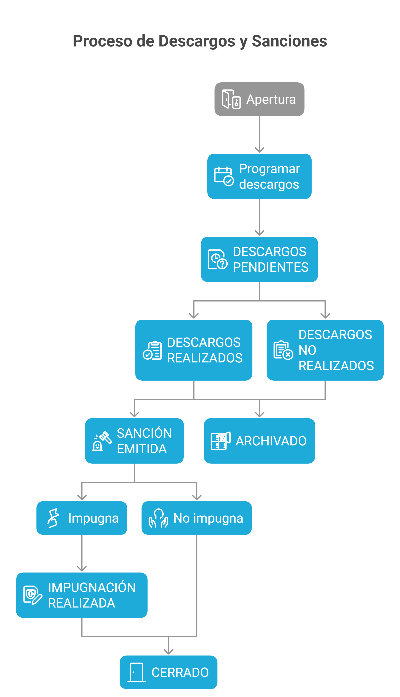

## Diagrama de Estados



## Descripción de Estados

### 1. Apertura

**Estado inicial** cuando se crea un nuevo proceso disciplinario.

| Atributo             | Valor                  |
| -------------------- | ---------------------- |
| Código               | `apertura`             |
| Color                | Azul                   |
| Siguiente            | `descargos_pendientes` |
| Acciones disponibles | Programar descargos    |

**Requisitos para avanzar:**

- Programar fecha de descargos
- Generar y enviar citación

### 2. Descargos Pendientes

El proceso tiene descargos programados y se espera la diligencia.

| Atributo             | Valor                                              |
| -------------------- | -------------------------------------------------- |
| Código               | `descargos_pendientes`                             |
| Color                | Amarillo                                           |
| Siguiente            | `descargos_realizados` o `descargos_no_realizados` |
| Acciones disponibles | Re-enviar Citación, Ver citación, Ver registro     |

**Requisitos para avanzar:**

- Realizar la diligencia de descargos
- O que el trabajador no se presente

### 3. Descargos Realizados

El trabajador asistió y se completaron los descargos.

| Atributo             | Valor                                       |
| -------------------- | ------------------------------------------- |
| Código               | `descargos_realizados`                      |
| Color                | Verde claro                                 |
| Siguiente            | `sancion_emitida` o `impugnacion_realizada` |
| Acciones disponibles | Emitir Sanción                              |

**Requisitos para avanzar:**

- Asignarle una sanción entre ellas `llamado de atención`, `suspensión laboral` o `terminación de contrato`

### 4. Descargos No Realizados

El trabajador no asistió a la diligencia programada.

| Atributo             | Valor                           |
| -------------------- | ------------------------------- |
| Código               | `descargos_no_realizados`       |
| Color                | Naranja                         |
| Siguiente            | `sancion_emitida` o `archivado` |
| Acciones disponibles | Emitir sanción, Reprogramar     |

:::caution[Nota Legal]
En Colombia, si el trabajador no asiste a descargos debidamente citado, se puede continuar el proceso y emitir sanción.
:::

### 5. Sanción Emitida

Se ha tomado una decisión disciplinaria y se ha notificado al trabajador.

| Atributo             | Valor                               |
| -------------------- | ----------------------------------- |
| Código               | `sancion_emitida`                   |
| Color                | Rojo                                |
| Siguiente            | `impugnacion_realizada` o `cerrado` |
| Acciones disponibles | Ver sanción, Registrar impugnación  |

**Información requerida:**

- Tipo de sanción
- Fundamento legal
- Fecha de notificación
- Fechas de vigencia (si aplica suspensión)

### 6. Impugnación Realizada

El trabajador ha presentado recurso contra la sanción.

| Atributo             | Valor                                              |
| -------------------- | -------------------------------------------------- |
| Código               | `impugnacion_realizada`                            |
| Color                | Morado                                             |
| Siguiente            | `cerrado`                                          |
| Acciones disponibles | Ver sanción, Ver impugnación, Resolver Impugnación |

**Tipos de impugnación:**

- Recurso de reposición
- Recurso de apelación

### 7. Cerrado

El proceso ha finalizado completamente.

| Atributo             | Valor                                 |
| -------------------- | ------------------------------------- |
| Código               | `cerrado`                             |
| Color                | Gris                                  |
| Siguiente (Opcional) | `archivado`                           |
| Acciones disponibles | Ver Sanción, Ver Resolución, Archivar |

### 8. Archivado

El proceso se cerró sin sanción.

| Atributo             | Valor                  |
| -------------------- | ---------------------- |
| Código               | `archivado`            |
| Color                | Gris claro             |
| Siguiente            | Ninguno (estado final) |
| Acciones disponibles | Solo consulta          |

**Razones para archivar:**

- Hechos no comprobados
- Falta no amerita sanción
- Prescripción del proceso
- Otros motivos justificados

## Transiciones de Estado

### Matriz de Transiciones

| Estado Actual             | Estados Siguientes Permitidos                     |
| ------------------------- | ------------------------------------------------- |
| `apertura`                | `descargos_pendientes`                            |
| `descargos_pendientes`    | `descargos_realizados`, `descargos_no_realizados` |
| `descargos_realizados`    | `sancion_emitida`                                 |
| `descargos_no_realizados` | `sancion_emitida`                                 |
| `sancion_emitida`         | `impugnacion_realizada`, `cerrado`                |
| `impugnacion_realizada`   | `cerrado`                                         |
| `cerrado`                 | `archivado`                                       |
| `archivado`               | -                                                 |

### Implementación

```php
// app/Services/EstadoProcesoService.php

class EstadoProcesoService
{
    protected array $transicionesValidas = [
        'apertura' => ['descargos_pendientes'],
        'descargos_pendientes' => ['descargos_realizados', 'descargos_no_realizados'],
        'descargos_realizados' => ['sancion_emitida'],
        'descargos_no_realizados' => ['sancion_emitida'],
        'sancion_emitida' => ['impugnacion_realizada', 'cerrado'],
        'impugnacion_realizada' => ['cerrado'],
        'cerrado' => ['archivado'],
        'archivado' => [],
    ];

    public function cambiarEstado(ProcesoDisciplinario $proceso, string $nuevoEstado): bool
    {
        if (!$this->puedeTransicionar($proceso->estado, $nuevoEstado)) {
            throw new InvalidStateTransitionException(
                "No se puede cambiar de '{$proceso->estado}' a '{$nuevoEstado}'"
            );
        }

        $estadoAnterior = $proceso->estado;
        $proceso->estado = $nuevoEstado;
        $proceso->save();

        // Registrar en timeline
        app(TimelineService::class)->registrarEvento(
            $proceso,
            'cambio_estado',
            "Estado cambiado de {$estadoAnterior} a {$nuevoEstado}"
        );

        return true;
    }

    public function puedeTransicionar(string $estadoActual, string $nuevoEstado): bool
    {
        return in_array($nuevoEstado, $this->transicionesValidas[$estadoActual] ?? []);
    }

    public function getEstadosSiguientes(string $estadoActual): array
    {
        return $this->transicionesValidas[$estadoActual] ?? [];
    }
}
```

## Colores y Badges

```php
// En ProcesoDisciplinarioResource.php

public static function getEstadoColor(string $estado): string
{
    return match ($estado) {
        'apertura' => 'info',
        'descargos_pendientes' => 'warning',
        'descargos_realizados' => 'success',
        'descargos_no_realizados' => 'danger',
        'sancion_emitida' => 'danger',
        'impugnacion_realizada' => 'purple',
        'cerrado' => 'success',
        'archivado' => 'gray',
        default => 'secondary',
    };
}
```

## Timeline de Ejemplo

```
Proceso PD-2026-001

├─ 15/01/2026 09:00 - APERTURA
│  └─ Proceso creado por Admin
│
├─ 15/01/2026 09:10 - DESCARGOS_PENDIENTES
│  └─ Descargos programados para 23/01/2026
│
├─ 15/01/2026 09:11 - Citación generada
│  └─ Citación enviada al correo del trabajador
│
├─ 21/01/2026 10:00 - DESCARGOS_REALIZADOS
│  └─ Diligencia completada - 28 preguntas respondidas
│
├─ 25/01/2026 14:00 - SANCION_EMITIDA
│  └─ Suspensión de 3 días emitida
│
└─ 30/01/2026 09:00 - CERRADO
   └─ Proceso cerrado - Sanción cumplida
```

## Próximos Pasos

- [Diagrama de Flujo](/flujo/diagrama-flujo/) - Visualización completa
- [Reglas de Negocio](/flujo/reglas-negocio/) - Validaciones del proceso
