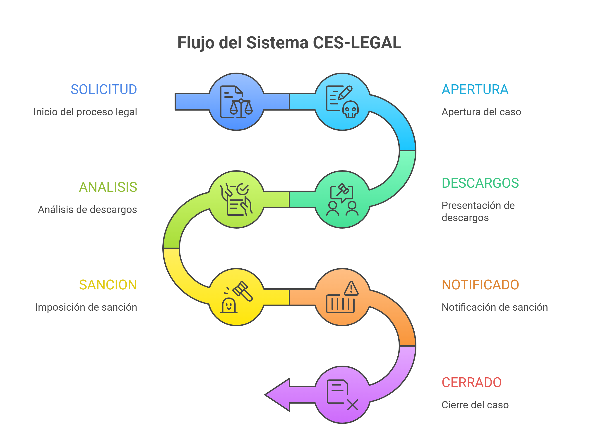

## ¿Qué es CES Legal?

**CES Legal** es un bufete de abogados en Colombia que ofrece asesoría y representación legal a clientes, con un enfoque en servicios jurídicos para empresas y apoyo en materias como laboral, contractual y corporativo. Adicionalmente, ha desarrollado una plataforma web integral diseñada para **automatizar y gestionar procesos disciplinarios laborales en Colombia**, la cual permite a empresas y bufetes de abogados administrar todo el ciclo de vida de un proceso disciplinario, desde la solicitud inicial hasta el cierre del caso.

## Objetivo Principal

Reducir tiempos de tramitación, asegurar consistencia jurídica y mantener auditoría completa de cada proceso disciplinario, todo esto con asistencia de **Inteligencia Artificial**.

## Características Principales

### 1. Gestión Completa de Procesos
- Creación de procesos con hechos, los motivos de los descargos, artículos incumplidos y pruebas
- Sistema de estados automatizada
- Timeline completo de auditoría

### 2. Diligencia de Descargos
- Generación automática de citaciones
- Formulario público para el trabajador con token temporal
- Timer de 45 minutos para completar descargos

### 3. Inteligencia Artificial
- Generación automática de preguntas de descargos
- Preguntas dinámicas basadas en respuestas
- Análisis jurídico con recomendación de sanciones
- Trazabilidad completa de interacciones con IA

### 4. Generación de Documentos
- Citaciones en PDF
- Actas de descargos
- Documentos de sanción
- Interpolación de variables dinámicas

### 5. Sistema de Notificaciones
- Notificaciones en tiempo real
- Seguimiento de apertura de emails
- Alertas por prioridad

### 6. Control de Acceso
- Roles: Administrador, Abogado, Cliente
- Permisos granulares con Filament Shield
- Aislamiento de datos por empresa (multi-tenant)

## ¿Para quién es CES Legal?

| Rol | Descripción |
|-----|-------------|
| **Administrador** | Control total del sistema, gestión de usuarios y configuraciones |
| **Abogado** | Gestiona procesos asignados, genera documentos, realiza análisis |
| **Cliente (RRHH)** | Solicita procesos, consulta estado, ve sus trabajadores |

## Flujo Principal del Sistema

## Próximos Pasos

- [Instalación](/inicio/instalacion/) - Configura el proyecto en tu entorno local
- [Configuración](/inicio/configuracion/) - Configura las variables de entorno
- [Arquitectura](/arquitectura/vision-general/) - Conoce la estructura del sistema
