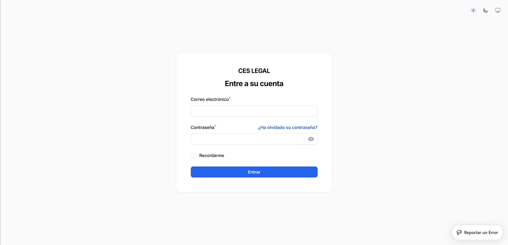
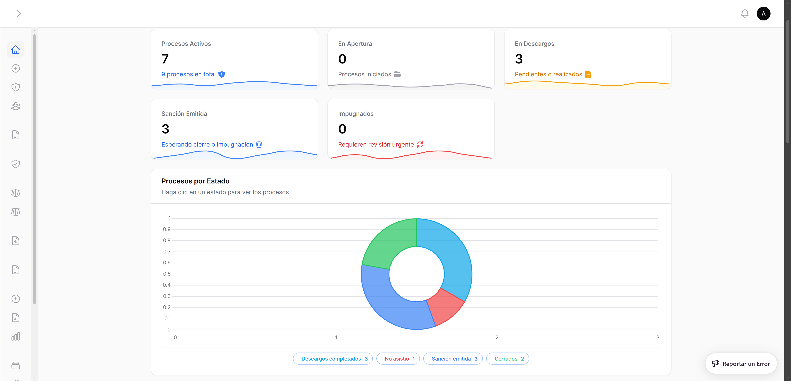

## Descripcion del Rol

El **Administrador** (rol `super_admin`) tiene acceso total al sistema CES Legal. Es responsable de la configuracion general, gestion de usuarios, administracion de empresas y supervision de todos los procesos disciplinarios del sistema.

### Capacidades del Administrador

- Acceso completo a todos los recursos sin restricciones
- Gestion de usuarios y asignacion de roles
- Administracion de empresas clientes
- Supervision de procesos de todas las empresas
- Configuracion del catalogo de sanciones laborales
- Configuracion del catalogo de articulos legales
- Gestion de permisos con Filament Shield
- Acceso a widgets y reportes del dashboard

---

## Acceso al Sistema

### Paso 1: Iniciar Sesion

1. Abra el navegador y acceda a la URL del sistema: `https://su-dominio.com/admin`
2. Ingrese su correo electronico y contrasena
3. Haga clic en **Iniciar Sesion**



:::tip[Credenciales iniciales]
Las credenciales del administrador se configuran durante la instalacion del sistema. Si es la primera vez que accede, consulte con el equipo de desarrollo.
:::

### Paso 2: Dashboard Principal

Al iniciar sesion, vera el dashboard con widgets de resumen:

- **Procesos por estado**: Grafico con la distribucion de procesos (apertura, pendientes, realizados, etc.)
- **Procesos pendientes**: Lista de procesos que requieren atencion
- **Calendario de diligencias**: Proximas diligencias de descargos programadas
- **Usuarios activos**: Cantidad de usuarios en el sistema



---

## Gestion de Usuarios

### Crear un Nuevo Usuario

1. En el menu lateral, vaya a **Administracion** > **Usuarios**
2. Haga clic en el boton **Crear Usuario** (esquina superior derecha)
3. Complete el formulario:

| Campo                | Descripcion                                   |   Requerido   |
| -------------------- | --------------------------------------------- | :-----------: |
| Nombre Completo      | Nombre del usuario                            |      Si       |
| Correo Electronico   | Se genera automaticamente basado en el nombre |      Si       |
| Rol                  | Administrador, Abogado o Cliente              |      Si       |
| Empresa Asignada     | Solo visible y requerido para rol Cliente     |  Condicional  |
| Contrasena           | Minimo 8 caracteres                           | Si (creacion) |
| Confirmar Contrasena | Debe coincidir                                | Si (creacion) |
| Usuario Activo       | Habilitar/deshabilitar acceso                 |      No       |

4. Haga clic en **Crear**

<!--  -->

:::caution[Asignacion de Empresa]
Al crear un usuario con rol **Cliente**, es obligatorio asignarle una empresa. El cliente solo podra ver y gestionar datos de esa empresa especifica.
:::

### Editar un Usuario

1. En la lista de usuarios, haga clic en **Editar** junto al usuario
2. Modifique los campos necesarios
3. **Nota**: Deje el campo de contrasena vacio para mantener la contrasena actual
4. Haga clic en **Guardar cambios**

### Desactivar un Usuario

1. Edite el usuario
2. Desactive el toggle **Usuario Activo**
3. Guarde los cambios
4. El usuario no podra acceder al sistema hasta ser reactivado

### Roles Disponibles

| Rol           | Codigo        | Descripcion                                          |
| ------------- | ------------- | ---------------------------------------------------- |
| Administrador | `super_admin` | Acceso total al sistema                              |
| Abogado       | `abogado`     | Gestiona procesos disciplinarios y contratos         |
| Cliente       | `cliente`     | Visualiza procesos de su empresa y gestiona personal |

---

## Gestion de Empresas

### Crear una Nueva Empresa

1. En el menu lateral, vaya a **Administracion** > **Empresas**
2. Haga clic en **Crear Empresa**
3. Complete la informacion:

**Seccion Informacion de la Empresa:**

- Razon social (nombre legal completo)
- NIT (con formato automatico `999999999-9`)
- Representante legal
- Estado activa/inactiva

**Seccion Informacion de Contacto:**

- Telefono
- Email de contacto
- Direccion completa

**Seccion Ubicacion:**

- Departamento (32 departamentos de Colombia)
- Ciudad (se carga dinamicamente segun el departamento)

4. Haga clic en **Crear**

<!--  -->

### Eliminar una Empresa

:::caution[Restricciones de Eliminacion]
No se puede eliminar una empresa que tenga:

- Procesos disciplinarios asociados
- Trabajadores registrados

Primero debe eliminar o reasignar esos registros.
:::

### Ver Detalle de una Empresa

En la lista de empresas puede ver:

- Razon social y NIT
- Ciudad y departamento
- Telefono y email
- Representante legal
- Cantidad de trabajadores registrados
- Estado activa/inactiva

---

## Supervision de Procesos Disciplinarios

### Vista General

Como administrador, puede ver **todos** los procesos de **todas** las empresas.

1. Vaya a **Historial de Descargos** en el menu lateral
2. La tabla muestra todos los procesos con:
    - Codigo del proceso
    - Trabajador involucrado
    - Empresa
    - Estado actual (con badge de color)
    - Abogado asignado
    - Fechas relevantes

### Filtros Disponibles

- **Por estado**: Apertura, Descargos pendientes, Realizados, Sancion emitida, etc.
- **Por empresa**: Filtrar procesos de una empresa especifica
- **Por abogado**: Ver procesos asignados a un abogado particular
- **Por fecha**: Rango de fechas de creacion

### Acciones sobre Procesos

Dependiendo del estado del proceso, el administrador puede:

| Estado                  | Acciones Disponibles                                   |
| ----------------------- | ------------------------------------------------------ |
| Apertura                | Editar, asignar abogado, programar descargos           |
| Descargos pendientes    | Ver citacion, generar preguntas IA, ver tracking email |
| Descargos realizados    | Ver acta, analizar con IA, emitir sancion, archivar    |
| Descargos no realizados | Emitir sancion, archivar, reprogramar                  |
| Sancion emitida         | Ver sancion, registrar impugnacion, cerrar             |
| Impugnacion realizada   | Resolver, cerrar                                       |
| Cerrado / Archivado     | Solo consulta                                          |

### Crear un Proceso Disciplinario

1. Haga clic en **Crear Descargos** en el menu lateral
2. Complete el formulario paso a paso:
    - Seleccione la empresa
    - Seleccione el trabajador (filtrado por empresa)
    - Describa los hechos ocurridos
    - Seleccione la fecha de ocurrencia
    - Seleccione los articulos legales incumplidos
    - Seleccione las sanciones laborales aplicables
    - Adjunte pruebas iniciales (opcional)
3. Haga clic en **Crear**

<!--  -->

---

## Catalogo de Sanciones Laborales

### Descripcion

El sistema incluye un catalogo de **63 tipos de sanciones** laborales predefinidas, clasificadas segun la legislacion laboral colombiana.

### Acceder al Catalogo

1. Vaya a **Configuracion** > **Sanciones Laborales**
2. Vera la lista completa con:
    - Numero de orden
    - Tipo de falta (Leve / Grave)
    - Nombre claro de la sancion
    - Tipo de sancion (Llamado de atencion / Suspension / Terminacion)
    - Dias de suspension (si aplica)
    - Estado activa/inactiva

### Crear una Nueva Sancion

1. Haga clic en **Crear Sancion Laboral**
2. Complete los campos:
    - **Tipo de Falta**: Leve o Grave
    - **Nombre Claro**: Descripcion corta y comprensible (ej: "Retardo de 15 minutos, 1ra vez")
    - **Descripcion Completa**: Detalle de la conducta sancionable
    - **Tipo de Sancion**: Llamado de atencion, Suspension o Terminacion
    - **Dias de Suspension** (min/max): Solo si el tipo es Suspension
    - **Activa**: Si aparecera en los selectores al crear procesos

### Tipos de Sancion

| Tipo                | Descripcion                              | Ejemplo                               |
| ------------------- | ---------------------------------------- | ------------------------------------- |
| Llamado de Atencion | Amonestacion escrita                     | Retardo menor a 15 min (1ra vez)      |
| Suspension          | Suspension temporal del contrato         | Inasistencia injustificada (1-8 dias) |
| Terminacion         | Terminacion del contrato con justa causa | Falta gravisima reiterada             |

### Activar/Desactivar Sanciones

- En la lista, haga clic en **Activar** o **Desactivar** junto a la sancion
- Las sanciones desactivadas no aparecen en los selectores al crear procesos
- Es posible activar/desactivar en lote seleccionando varias sanciones

---

## Gestion de Permisos (Filament Shield)

### Descripcion

CES Legal utiliza **Filament Shield** (basado en Spatie Laravel Permission) para gestionar permisos granulares por recurso.

### Acceder a la Gestion de Permisos

1. Vaya a **Administracion** > **Shield** (si esta habilitado en el menu)
2. Vera la lista de roles con sus permisos asociados

### Permisos por Recurso

Cada recurso de Filament tiene los siguientes permisos:

| Permiso                | Descripcion       |
| ---------------------- | ----------------- |
| `view_any_{recurso}`   | Ver listado       |
| `view_{recurso}`       | Ver detalle       |
| `create_{recurso}`     | Crear registro    |
| `update_{recurso}`     | Editar registro   |
| `delete_{recurso}`     | Eliminar registro |
| `delete_any_{recurso}` | Eliminar en lote  |

### Modificar Permisos de un Rol

1. Seleccione el rol a editar
2. Active o desactive los permisos individuales por recurso
3. Guarde los cambios

:::caution[Precaucion]
Modificar permisos del rol `super_admin` puede resultar en perdida de acceso a funcionalidades criticas. Realice cambios con precaucion.
:::

---

## Onboarding y Tutorial

### Descripcion

El sistema incluye un tour de onboarding interactivo que guia a los nuevos usuarios por las funcionalidades principales.

### Gestion del Tour

Como administrador, puede:

- Ver que usuarios han completado el tour
- Resetear el estado del tour para un usuario (forzar que lo vea de nuevo)
- Configurar los pasos del tour para cada modulo

Los atributos `data-tour` en los formularios definen los elementos que el tour resalta:

- `data-tour="trabajador-empresa"` - Selector de empresa en trabajadores
- `data-tour="trabajador-tipo-doc"` - Tipo de documento
- `data-tour="trabajador-nombres"` - Campo de nombres
- etc.

---

## Monitoreo de Email Tracking

### Ver Estado de Correos

1. En cualquier proceso disciplinario, busque la seccion de **Tracking de Email**
2. Podra ver:
    - Si la citacion fue enviada y leida
    - Si la sancion fue notificada y leida
    - Cantidad de veces que el correo fue abierto
    - Fecha y hora de primera apertura
    - Tiempo transcurrido entre envio y apertura

### Interpretacion de Estados

| Estado               | Significado                 | Accion Sugerida                 |
| -------------------- | --------------------------- | ------------------------------- |
| Pendiente (gris)     | Correo no procesado         | Verificar direccion de email    |
| Entregado (amarillo) | Llego al servidor de correo | Esperar apertura del trabajador |
| Leido (verde)        | Trabajador abrio el correo  | Proceder con el siguiente paso  |

---

## Problemas Comunes y Soluciones

### No puedo eliminar una empresa

**Causa:** La empresa tiene procesos disciplinarios o trabajadores asociados.
**Solucion:** Primero elimine o reasigne los procesos y trabajadores de esa empresa.

### Un usuario no puede acceder al sistema

**Verificar:**

1. Que el usuario tenga el toggle **Activo** habilitado
2. Que el rol asignado sea `super_admin`, `abogado` o `cliente`
3. Si es cliente, que tenga una empresa asignada
4. Que la contrasena sea correcta (resetearla si es necesario)

### El catalogo de sanciones no muestra todas las opciones

**Causa:** Algunas sanciones pueden estar desactivadas.
**Solucion:** Vaya a **Configuracion** > **Sanciones Laborales** y use el filtro **Activa** > **Inactivas** para ver las sanciones ocultas. Active las que necesite.

### Los correos no se estan rastreando

**Verificar:**

1. Que el servicio de email este configurado correctamente en `.env`
2. Que las rutas de tracking esten accesibles (`/email/track/{token}.gif`)
3. Que el cliente de correo del trabajador no bloquee imagenes externas

---

## Archivos Relacionados

```
app/Filament/Admin/Resources/UserResource.php
app/Filament/Admin/Resources/EmpresaResource.php
app/Filament/Admin/Resources/ProcesoDisciplinarioResource.php
app/Filament/Admin/Resources/SancionLaboralResource.php
app/Filament/Admin/Resources/ArticuloLegalResource.php
app/Models/User.php
app/Policies/ (todos los archivos de politicas)
```

## Proximos Pasos

- [Manual del Abogado](/manuales/abogado/) - Guia para el rol de abogado
- [Manual del Cliente](/manuales/cliente/) - Guia para el rol de cliente (RRHH)
- [Rutas Protegidas](/api/rutas-protegidas/) - Referencia tecnica de endpoints
