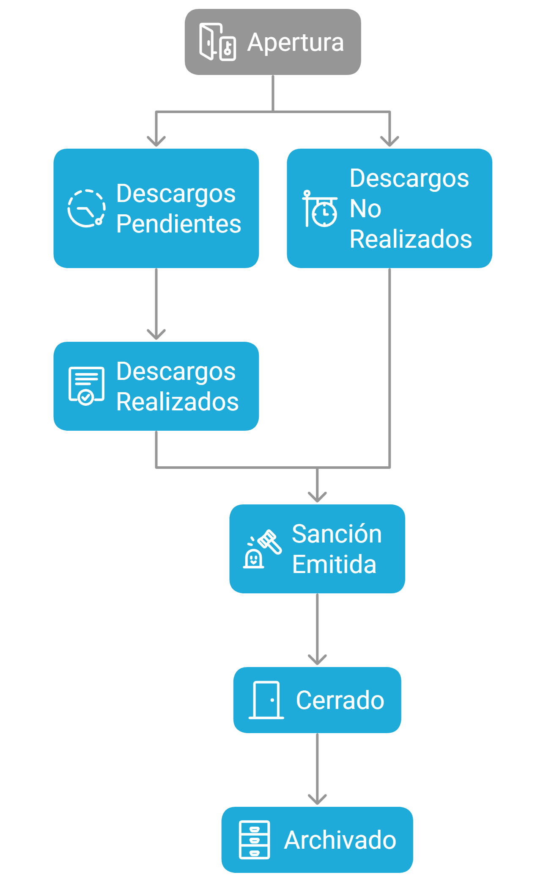

## Descripcion General

El modulo de **Procesos Disciplinarios** es el nucleo central de CES Legal. Permite gestionar el ciclo de vida completo de un proceso disciplinario laboral colombiano, desde la apertura hasta el cierre o archivo. Integra inteligencia artificial para la generacion de preguntas de descargos y el analisis de sanciones, generacion automatica de documentos legales, envio de citaciones por correo electronico con tracking de lectura, y un timeline completo de auditoria.

El recurso principal es `ProcesoDisciplinarioResource`, ubicado en:

```
app/Filament/Admin/Resources/ProcesoDisciplinarioResource.php
```

## Caracteristicas Principales

### Codigo Auto-generado

Cada proceso recibe un codigo unico con formato `PD-YYYY-XXXX`, donde `YYYY` es el año y `XXXX` un consecutivo de cuatro digitos. Este codigo se genera automaticamente al crear el proceso y sirve como identificador en todos los documentos y comunicaciones.

### Maquina de Estados

El proceso sigue un flujo controlado por el servicio `EstadoProcesoService`. Las transiciones validas son:



**Flujo principal:**

| Estado                    | Descripcion                                        | Color      |
| ------------------------- | -------------------------------------------------- | ---------- |
| `apertura`                | Proceso iniciado, pendiente de programar descargos | Azul       |
| `descargos_pendientes`    | Citacion enviada, esperando diligencia             | Amarillo   |
| `descargos_realizados`    | Trabajador completó la diligencia                  | Verde      |
| `descargos_no_realizados` | Trabajador no asistió                              | Naranja    |
| `sancion_emitida`         | Sanción emitida y notificada                       | Rojo       |
| `impugnacion_realizada`   | Trabajador impugnó la sanción                      | Morado     |
| `cerrado`                 | Proceso finalizado                                 | Gris       |
| `archivado`               | Proceso archivado                                  | Gris claro |

Desde el estado `cerrado` se puede transicionar a `archivado`.

### Asignacion de Abogado

Al crear o editar un proceso, si es presencial o telefonico se asigna un abogado (`abogado_id`) que sera responsable del caso. El abogado recibe una notificacion automatica al ser asignado.

### Programacion de Diligencia de Descargos

Se programa la fecha, hora y modalidad de la audiencia de descargos:

- **Presencial**: Se incluye la direccion de la empresa en la citacion.
- **Virtual**: Se genera un enlace de acceso con token temporal.
- **Telefonico**: Modalidad por llamada telefonica.

### Generacion y Envio de Citacion

Al hacer clic en la accion "Crear", el sistema:

1. Genera un documento DOCX usando la plantilla con interpolacion de variables (`TemplateProcessor` de PHPWord).
2. Convierte el DOCX a PDF usando LibreOffice (con fallback a DOCX si no esta disponible).
3. Crea la diligencia de descargos con token de acceso temporal (6 dias).
4. Genera preguntas automaticas con IA (10 iniciales estandar + preguntas especificas generadas por Gemini + 3 de cierre).
5. Envia el correo electronico al trabajador con la citacion adjunta y pixel de tracking.
6. Cambia el estado automaticamente a `descargos_pendientes`.
7. Registra el evento en el timeline.

### Generacion de Preguntas con IA

El servicio `IADescargoService` genera preguntas en dos momentos:

- **Al enviar la citacion**: Genera preguntas iniciales estandar (10) + preguntas especificas basadas en los hechos (hasta 1) + preguntas de cierre (3).
- **Durante la diligencia**: Genera preguntas dinamicas basadas en las respuestas del trabajador (hasta 1 por respuesta, maximo 30 preguntas totales).

Las preguntas siguen principios de **lenguaje claro**: oraciones cortas, palabras sencillas, sin jerga juridica compleja.

### Emision de Sancion con IA

Al emitir una sancion, el sistema:

1. Ejecuta `IAAnalisisSancionService` para analizar la gravedad, reincidencia y recomendar tipo de sancion.
2. Genera el documento de sancion con `DocumentGeneratorService` usando IA con principios de lenguaje claro.
3. Convierte el documento HTML a PDF.
4. Envia la sancion por correo con pixel de tracking.
5. Actualiza el estado a `sancion_emitida`.
6. Registra en el timeline.

### Timeline y Auditoria

Cada accion relevante se registra en la tabla `timeline` con:

- Tipo de accion (cambio de estado, documento generado, notificacion enviada)
- Usuario que realizo la accion
- Estado anterior y nuevo
- Metadata adicional (IP, user agent)
- Fecha y hora

## Modelo de Datos

### Tabla: `procesos_disciplinarios`

| Campo                        | Tipo      | Descripcion                                |
| ---------------------------- | --------- | ------------------------------------------ |
| `id`                         | bigint    | Identificador unico                        |
| `codigo`                     | string    | Codigo auto-generado (PD-YYYY-XXXX)        |
| `empresa_id`                 | foreignId | Empresa a la que pertenece el proceso      |
| `trabajador_id`              | foreignId | Trabajador involucrado                     |
| `abogado_id`                 | foreignId | Abogado asignado (User)                    |
| `estado`                     | string    | Estado actual del proceso                  |
| `hechos`                     | text      | Descripcion de los hechos                  |
| `fecha_ocurrencia`           | date      | Fecha en que ocurrieron los hechos         |
| `normas_incumplidas`         | text      | Normas presuntamente incumplidas           |
| `articulos_legales_ids`      | json      | IDs de articulos legales seleccionados     |
| `sanciones_laborales_ids`    | json      | IDs de sanciones laborales del reglamento  |
| `pruebas_iniciales`          | text      | Pruebas aportadas inicialmente             |
| `fecha_solicitud`            | datetime  | Fecha de solicitud del proceso             |
| `fecha_apertura`             | datetime  | Fecha de apertura formal                   |
| `fecha_descargos_programada` | datetime  | Fecha programada para descargos            |
| `hora_descargos_programada`  | time      | Hora programada para descargos             |
| `modalidad_descargos`        | string    | Modalidad: presencial, virtual, telefonico |
| `fecha_descargos_realizada`  | datetime  | Fecha real de la diligencia                |
| `fecha_analisis`             | datetime  | Fecha del analisis juridico                |
| `decision_sancion`           | boolean   | Si se decidio aplicar sancion              |
| `motivo_archivo`             | text      | Motivo si se archiva                       |
| `tipo_sancion`               | string    | Tipo de sancion aplicada                   |
| `dias_suspension`            | integer   | Dias de suspension (si aplica)             |
| `fecha_notificacion`         | datetime  | Fecha de notificacion al trabajador        |
| `fecha_limite_impugnacion`   | datetime  | Fecha limite para impugnar                 |
| `impugnado`                  | boolean   | Si fue impugnado                           |
| `fecha_impugnacion`          | datetime  | Fecha de la impugnacion                    |
| `fecha_cierre`               | datetime  | Fecha de cierre del proceso                |

### Casts

```php
protected $casts = [
    'fecha_ocurrencia' => 'date',
    'fecha_solicitud' => 'datetime',
    'fecha_apertura' => 'datetime',
    'decision_sancion' => 'boolean',
    'impugnado' => 'boolean',
    'articulos_legales_ids' => 'array',
    'sanciones_laborales_ids' => 'array',
];
```

## Relaciones con Otros Modulos

| Relacion             | Tipo      | Modelo Relacionado   | Descripcion                              |
| -------------------- | --------- | -------------------- | ---------------------------------------- |
| `empresa`            | BelongsTo | `Empresa`            | Empresa a la que pertenece               |
| `trabajador`         | BelongsTo | `Trabajador`         | Trabajador involucrado                   |
| `abogado`            | BelongsTo | `User`               | Abogado asignado                         |
| `diligenciaDescargo` | HasOne    | `DiligenciaDescargo` | Diligencia de descargos                  |
| `sancion`            | HasOne    | `Sancion`            | Sancion aplicada                         |
| `impugnacion`        | HasOne    | `Impugnacion`        | Impugnacion presentada                   |
| `analisisJuridicos`  | HasMany   | `AnalisisJuridico`   | Analisis juridicos realizados            |
| `documentos`         | MorphMany | `Documento`          | Documentos generados (citacion, sancion) |
| `timeline`           | HasMany   | `Timeline`           | Registro de auditoria                    |
| `terminosLegales`    | HasMany   | `TerminoLegal`       | Plazos legales asociados                 |
| `emailTrackings`     | HasMany   | `EmailTracking`      | Tracking de correos enviados             |

## Notas de Uso

### Permisos por Rol

- **super_admin**: Acceso completo a todos los procesos de todas las empresas.
- **abogado**: Puede ver y gestionar los procesos que le han sido asignados. Puede emitir sanciones y generar analisis con IA.
- **cliente**: Solo puede ver los procesos de su propia empresa. No puede emitir sanciones directamente.

### Acciones Disponibles en la Tabla

Las acciones visibles dependen del estado actual del proceso:

- **Re-enviar Citacion**: Disponible en estado `descargos_pendientes`.
- **Emitir Sancion**: Disponible en estados `descargos_realizados` o `descargos_no_realizados`.
- **Ver Sanción**: Disponible en estado `sancion_emitida`.
- **Descargar Documentos**: Disponible cuando hay documentos generados.

### SoftDeletes

El modelo utiliza `SoftDeletes`, lo que permite recuperar procesos eliminados accidentalmente.

### Atributos Computados

- `articulosLegales`: Devuelve la coleccion de articulos legales seleccionados.
- `articulosLegalesTexto`: Texto formateado de los articulos para documentos.
- `articulosLegalesCodigos`: Solo los codigos en formato corto.
- `sancionesLaborales`: Coleccion de sanciones laborales del reglamento.
- `sancionesLaboralesTexto`: Texto completo formateado de las sanciones.
- `sancionesLaboralesNombres`: Solo los nombres claros.
- `ultimoTrackingCitacion`: Ultimo tracking de correo de citacion.
- `ultimoTrackingSancion`: Ultimo tracking de correo de sancion.

## Servicios Involucrados

| Servicio                   | Responsabilidad                       |
| -------------------------- | ------------------------------------- |
| `EstadoProcesoService`     | Maquina de estados y transiciones     |
| `DocumentGeneratorService` | Generacion de citaciones y sanciones  |
| `IADescargoService`        | Generacion de preguntas con IA        |
| `IAAnalisisSancionService` | Analisis y recomendacion de sanciones |
| `TimelineService`          | Registro de auditoria                 |
| `NotificacionService`      | Notificaciones a usuarios             |
| `TerminoLegalService`      | Control de plazos legales             |

## Proximos Pasos

- [Trabajadores](/modulos/trabajadores/) - Gestion de trabajadores
- [Diligencias de Descargos](/modulos/diligencias-descargos/) - Formulario publico de descargos
- [Sanciones](/modulos/sanciones/) - Emision de sanciones
- [Documentos](/modulos/documentos/) - Generacion de documentos
